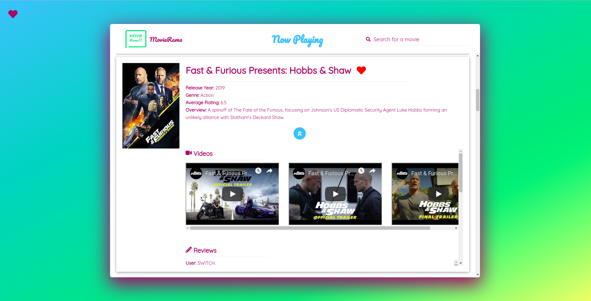

# MovieRama



MovieRama is a single page application that utilizes the [MovieDB API](https://developers.themoviedb.org/3) to allow you to browse movies, watch trailers, read reviews, and more. It is developed in completely vanilla JS. The only dependencies are a few Babel and Webpack packages required for transpiling / compiling. It is also responsive, so you can explore movies from your phone as well!

More specifically, the app allows you to:

* Browse movies currently in theaters
* Search for movies
* View more movie details (videos, reviews, and similar movies)
* **Bonus:** Save movies to a list that is stored in `localStorage` (ie, persists across page reloads, browser closes, etc).

For the last feature, I intentionally left the wording of the functionality vague in the UI. That is, you won't see the phrases 'like', 'favorite', 'want to see', 'add to wishlist', etc. when interacting with the related UI elements. This gives the user the freedom to interpret and use the functionality however they wish. I think its much more user-friendly and flexible this way! 

In the codebase however, this functionality is represented by the concept of "Likes" - but this is simply because it was most easy for me to reason about the logic that way.

## Install
To install, `cd` to project root and run:
```
$ npm install
```
This will install the required Babel and Weback dependencies. From there, you can build or run the app.

## Build
To build for production, `cd` to project root and run:
```
$ npm run build
```
This will run `webpack` with the `--mode` option set to `production`, which optimizes the build for a production setting. You can read more about this option [here](https://webpack.js.org/configuration/mode/).

To build for development, `cd` to project root and run:
```
$ npm run dev
```
This will run `webpack` with the `--mode` opption set to `develdopment`.

## Run
To run the app in development, `cd` to project root and run:
```
$ npm start
```
This will run `webpack-dev-server` with hot reloading, allowing you to run the app in your browser, continue to develop, and see your changes take effect live.

## Test
This application does not rely on any testing framework. Instead, I have included a set of test suites (in reality just a set of IIFEs) in `index.test.js`. To run them, first comment out the test suite you want to run, then execute:
```
$ npm test
```
This uses `sed` to replace the entry point in `webpack.config.js` with `index.test.js` and then runs `webpack-dev-server` to compile the app and run the tests. From there you can check the browser's console for any error messages from failing tests. 

Also, since hot reloading is enabled, you can change tests, uncomment out other test suites, etc. without stopping `webpack`. Then, the next time you run a different `npm` script, `sed` will run again automatically setting the entry point back to `index.js`. 

## Optimizations
A few optimizations have been implemented to help improve the performance of the app, including:

* Caching of now playing results
* Caching of search results
* Lazy loading of main poster images
* Lazy loading of poster images in saved movies modal
* Including svgs within the app rather than relying on external loading (eg FontAwesome)
* Including fonts with the app rather than relying on external loading (eg Google Fonts)

## Improvements
Of course, improvements could still be made to both the optimization and overall functionality of the app. Some of these include:
* Caching 'more details' results (ie, videos, reviews, similar movies)
* Lazy loading videos and 'similar movies' poster images
* A better infinite scrolling implementation, using the `IntersectionObserver` API. See [here](https://medium.com/walmartlabs/infinite-scrolling-the-right-way-11b098a08815) for an idea.
* For the saved movies functionality, a way to remove saved movies from the saved movies modal.
* Filters for movie results.


